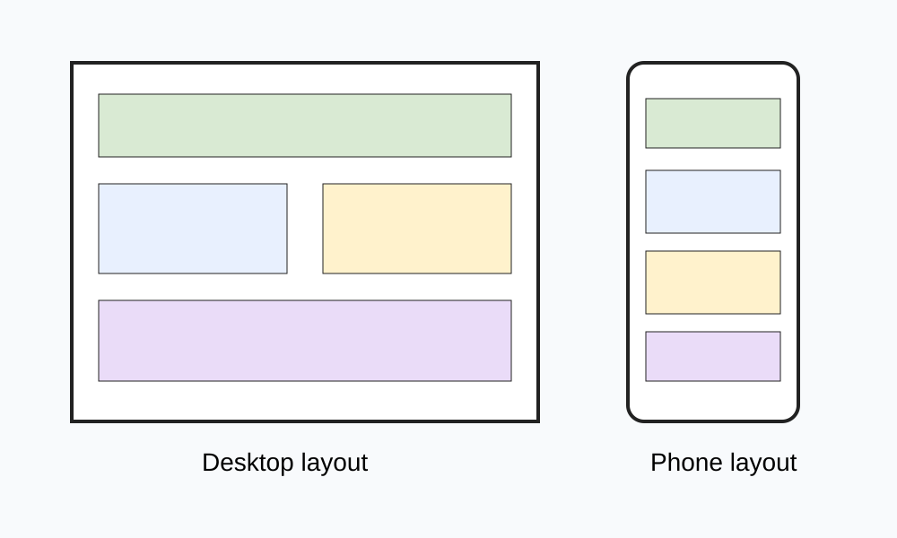

# :material-web: Website Development

Welcome to the website development lesson hub.

In these lessons, you will plan, design, build, test, and improve websites for different projects. Each project may have a different theme, audience, and purpose, but the same design process will help you make clear and useful pages.

You will learn how to:

- Plan a website for a specific audience
- Organise information into clear sections
- Design wireframes before building
- Create pages with a consistent layout
- Test and improve your work
- Explain the choices you made

---

## :material-map-marker-path: How to Use These Lessons

Work through each lesson in order. The activities will guide you from early planning to a finished website.

Most lessons include:

- Learning intention and success criteria
- Keywords
- Examples
- Levelled tasks
- Reflection questions

Use the navigation menu to choose your current project and lesson.
