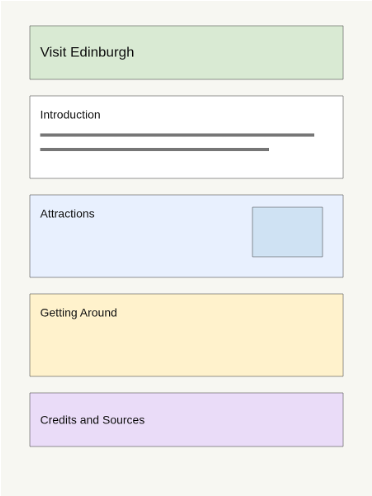

# :material-draw: 02 - Designing a Wireframe

## :dart: Learning Intention and Success Criteria

<table>
  <thead>
    <tr>
      <th>Learning Intention</th>
      <th>Success Criteria</th>
    </tr>
  </thead>
  <tbody>
    <tr>
      <td>
        <ul>
          <li>Learn what a wireframe is used for.</li>
          <li>Plan the sections for a one-page website.</li>
          <li>Decide where headings, text, and images could go.</li>
          <li>Create a wireframe before building the website.</li>
        </ul>
      </td>
      <td>
        
By the end of this lesson you will be able to:

        <ul>
          <li>I can explain what a wireframe is used for.</li>
          <li>I can choose suitable sections for my website.</li>
          <li>I can place sections in an order that helps the visitor.</li>
          <li>I can add clear notes about headings, text, and images.</li>
        </ul>
      </td>
    </tr>
  </tbody>
</table>

---

## :material-format-letter-case: Todays Keywords

<table class="keywords-table">
  <thead>
    <tr>
      <th>Keyword</th>
      <th>Meaning</th>
    </tr>
  </thead>
  <tbody>
    <tr>
      <td>Wireframe</td>
      <td>A simple plan that shows where the main parts of a web page will go.</td>
    </tr>
    <tr>
      <td>Section</td>
      <td>A block of related content on the page, such as attractions, transport, or visitor tips.</td>
    </tr>
    <tr>
      <td>Heading</td>
      <td>A short title that tells the visitor what a section is about.</td>
    </tr>
    <tr>
      <td>Content Order</td>
      <td>The sequence that information appears in on the page.</td>
    </tr>
    <tr>
      <td>Annotation</td>
      <td>A short note added to a design to explain what should be included.</td>
    </tr>
  </tbody>
</table>

---

## :triangular_ruler: Designing a Wireframe

Every website needs a clear visitor journey. Before we start building, we create a simple plan showing how the page will be organised.

In Web Development this is called a Wireframe.

A wireframe does not need finished colours, fonts, or images. It is a planning tool that helps you decide what each section will contain before you start building.

Wireframes help designers spot problems before they start building. Making changes to a wireframe is much quicker than rebuilding a finished website.

When creating your wireframe, think about:

- What the visitor needs first
- Which sections will be most useful
- Where headings, text, and images could go
- How the page will guide the visitor from top to bottom

### :material-account-group-outline: Designing for Your Audience

Different audiences may need information in a different order.

For example:

- Tourists may want attractions near the top of the page.
- Families may want visitor tips and facilities.
- First-time visitors may need transport information.
- Returning visitors may be more interested in events and activities.

Your wireframe should be organised to meet the needs of your chosen audience.

### :material-pencil-outline: What Is an Annotation?

An annotation is a short note added to a wireframe.

Annotations help explain:

- What text will go in a section
- What image could be used
- What heading should appear
- Any important information the visitor needs

Annotations make it easier for someone else to understand your design.

---

## :world_map: Example Layout

This is one possible section order for the `Visit Edinburgh` website.

| Section | Purpose |
|-----------|-----------|
| Title | A strong heading and image to welcome visitors. |
| Introduction | A short overview of what the page is about. |
| Attractions | Key places to visit in Edinburgh. |
| Transport | How to get to and around the city. |
| Visitor tips | Practical advice for a better trip. |
| Credits | Sources, image credits, and extra information. |

The order matters because visitors should see the most useful information before they reach smaller details such as credits.

---

## :material-playlist-check: Wireframe Checklist

Before you begin, make sure your wireframe has space for:

- A clear page title
- A short introduction
- At least three useful content sections
- Notes for headings
- Notes for text
- Notes for images
- Credits or source information

---

## :memo: Task

Use your answers from Task One to decide the sections, headings, and order of your website.

**Start at Level One then keep working through the questions.**

**Challenge yourself to see how far you can go.**

=== "Level One"

    Create a basic wireframe and add sections in an order that mostly makes sense.

=== "Level Two"

    Create a clear wireframe with suitable sections in a sensible order, with notes for headings, text, and images.

=== "Level Three"

    Create a detailed wireframe and add well-chosen sections in a logical order that guides the visitor.

=== "Level Four"

    Create a complete wireframe and add all key sections in the best order, with clear notes so someone else could build the page.

=== "Challenge Question"

    Justify your section order by linking it to the audience's needs.

---

## :material-comment-check-outline: Reflection

Before moving on, make sure you can:

- Explain what a wireframe is.
- Describe why a wireframe is useful before building.
- Choose suitable sections for a `Visit Edinburgh` website.
- Explain why your section order helps the visitor.
- Add clear notes so someone else could understand your design.
